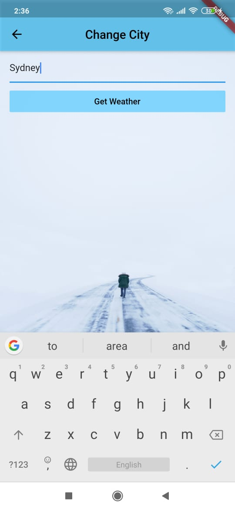
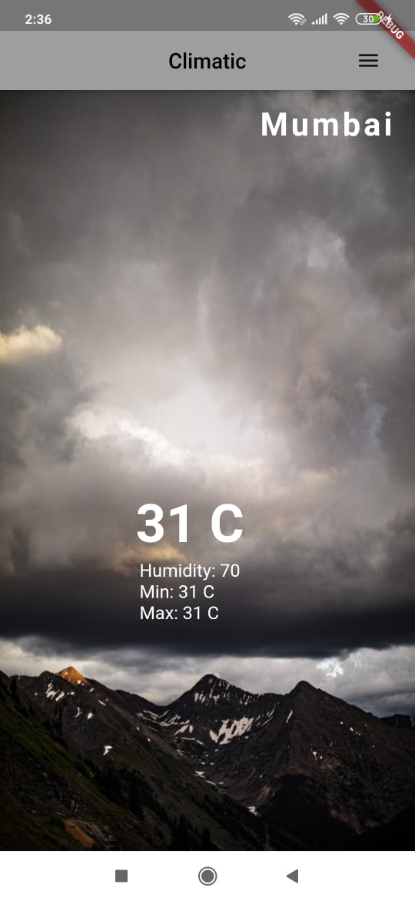
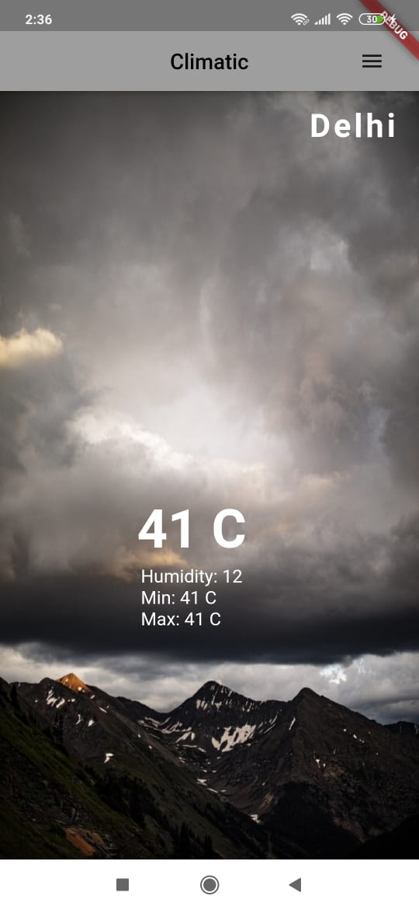
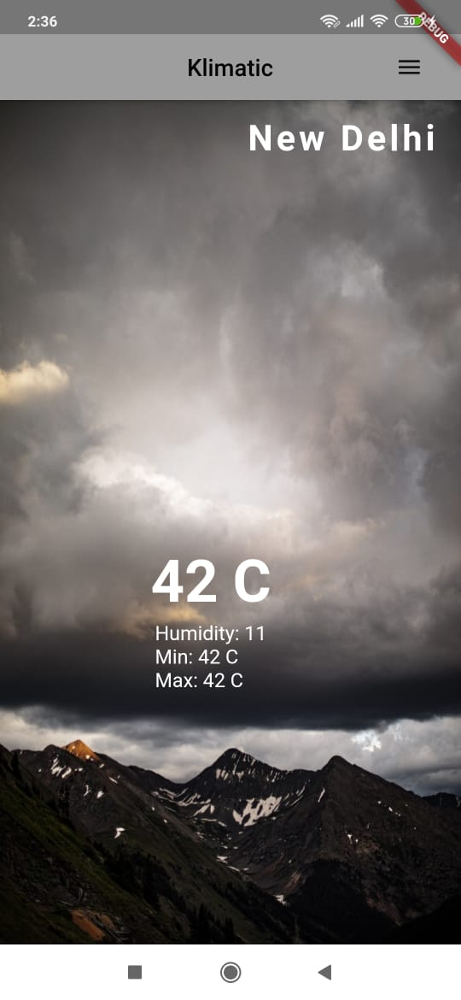

# climatic_app

As the name itself says (Climatic app). A app which fetches the weather report of the entered location by making a http call to the json api, only required information is parsed and displayed to the user. It gets the weather of NEW DELHI on opening the app as the default city.

## screenshots
||
|

## Getting Started

This project is a starting point for a Flutter application.

A few resources to get you started if this is your first Flutter project:

- [Lab: Write your first Flutter app](https://flutter.dev/docs/get-started/codelab)
- [Cookbook: Useful Flutter samples](https://flutter.dev/docs/cookbook)

For help getting started with Flutter, view our
[online documentation](https://flutter.dev/docs), which offers tutorials,
samples, guidance on mobile development, and a full API reference.
